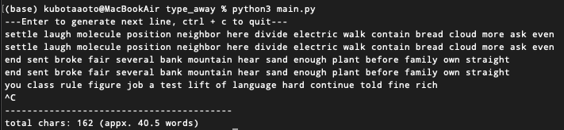

# type_away

type_away is a CLI application that lets you practice typing casually. This application is for those who just want to type something without having to worry about speed.



## How to use it
To set up and run this application, follow these steps:
1. Clone the repository:
```
git clone https://github.com/kubotaaoto/type_away
cd type_away
```
2. Run the program:
```
python3 main.py
```